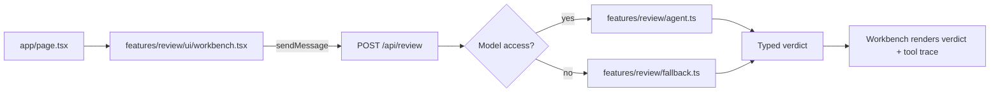

# Architecture

## Overview

## Key Files

- `features/review/ui/workbench.tsx`: client form state, streamed message rendering, and typed verdict display
- `app/api/review/route.ts`: request validation, agent vs fallback selection, and message metadata attachment
- `features/review/agent.ts`: bounded agent definition with prompt preparation and tool-step orchestration
- `features/review/tools.ts`: checklist and service-profile tools
- `features/review/fallback.ts`: deterministic fallback verdict generation
- `features/review/message-contract.ts`: typed UI message contract shared by the agent stream and the workbench
- `scripts/eval.ts`: deterministic regression checks and live smoke validation
- `scripts/fixtures/review-fixtures.ts`: canned eval inputs with expected outcomes for regression checks

## Why This Shape

- `ToolLoopAgent` keeps the review logic reusable and makes the tool loop explicit instead of hiding orchestration inside the route.
- `getReviewChecklist` is forced first so the multi-step flow is visible and predictable.
- `lookupServiceProfile` is conditional so the second tool only appears when the diff names a supported service.
- `Output.object(...)` makes the final verdict contract stable for both the route and the UI.
- `useChat` is the only client state primitive, so submission, streaming, stop, status, and rendering all live in one place.
- The server owns prompt construction, tool execution, model access, and fallback selection.
- The client only sends the current draft and renders the typed message stream.

## Why Patch Scope

- A single patch is the smallest review unit that still produces a concrete go/no-go decision.
- Patch scope keeps the trust boundary narrow and the latency, cost, and explanation burden predictable.
- The MVP optimizes for explainable risk triage, not full-repository retrieval or autonomous code review.

## Streaming Boundary

- The route streams one assistant message.
- Tool activity arrives as typed `tool-*` parts.
- The final verdict comes from the agent's structured `output` and is attached as typed message metadata so the UI can render a stable card without custom stream parsing.

## Future Extension

This flow is synchronous and user-initiated. The target path is a single review that finishes in one request.

If this later needs background execution, the next step is to move the same draft schema and verdict schema behind a durable job runner with:

- persisted run state
- richer observability around run duration, fallback reason, and traced failures
- retryable tool and model steps
- resumable status polling
- webhook or queue-based intake

## Agent Internals

| Stage | Main Code | Why It Exists |
| --- | --- | --- |
| Normalize request | `normalizeReviewDraft` | Clean and validate user input before the agent sees it. |
| Infer review context | `inferChangeType`, `extractSupportedServices` | Give the agent a bounded hint about patch type and named services. |
| Build prompt | `buildReviewPrompt`, `buildReviewInstructions` | Keep prompt construction on the server and make the review rubric explicit. |
| Prepare agent call | `ToolLoopAgent.prepareCall` | Attach the prompt and structured context for the run. |
| Choose tool behavior | `ToolLoopAgent.prepareStep` | Force the checklist tool first, then optionally allow the service-profile lookup. |
| Run tools | `getReviewChecklist`, `lookupServiceProfile` | Ground the model with explicit, typed tool outputs. |
| Produce verdict | `Output.object(reviewVerdictSchema)` | Require a stable structured verdict contract instead of free-form prose. |
| Attach final result | `result.output`, route metadata | Store the structured verdict in typed message metadata for UI rendering. |
